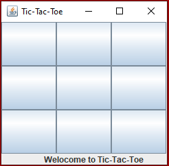
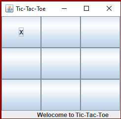
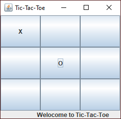
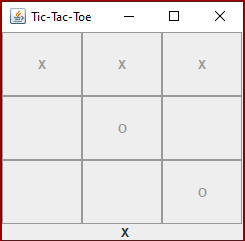

#  TIC-TAC-TOE

## Description
   This project is an implementation of a tic-tac-toe game. It was one of the projects of my **Software Engineering I** class. 
   It is written in java 8 and implemented using Model View Controller desgin pattern.
   It has two branches,
   
   1. **master**
   2. **GUIImplementation**
   
   The **"master"** branch implements the game in a console. The user can choose the size of a board by providing the arguments in the command prompt (for instance, cs310-tic-tac-toe.jar 4). The default board size for the game is 3x3 unless specified by the user. The first move is always the **X** followed by **O**. The game continues until one player wins or there is a **Tie**. This game in the console will look like below if a default size is applied,
   
                             Board Initially:               0 1 2
                                                          0 - - -
                                                          1 - - -
                                                          2 - - -
                                                          
                           i) After Player 1's (X) move     0 1 2
                                                          0 - - -
                                                          1 - X -
                                                          2 - - -
                                                          
                          ii) After Player 2's (O) move     0 1 2
                                                          0 - - -
                                                          1 - X -
                                                          2 - - O
                                                          
                         iii) After Player 1's (X) move     0 1 2
                                                          0 - X -
                                                          1 - X -
                                                          2 - - O
                                                          
                          iv) After Player 2's (O) move     0 1 2
                                                          0 - X -
                                                          1 - X O
                                                          2 - - O
                                                          
                           v) After Player 1's (X) move     0 1 2
                                                          0 - X -
                                                          1 - X O
                                                          2 - X O
                             
                                                      Remark: X wins!!!
                                                      
   The **"GUIImplementation"** branch implements the game in a GUI. It will display the board with 3x3 dimensions unless specified by the user when initializing the controller class. The user will make a move via a button click - the first move is always **X** move followed by **O**. The GUI implementation looks as below,                 
   
  
                               
    
    
    
    
    
    
 
                                    
   
   
   
   
   
   
                                    
                                    
  
                                   
                                   
                                   
          
          
          
          
                                   
  
  
  
  
  
  
  
  
  
  
  ## Running this Program
     The necessary tools to run this program are JDK 1.8, Netbeans, and Gradle. Once you have all these tools, you can clone the repository in your workstation by running this command (git clone https://github.com/sbanjara/cs310-tic-tac-toe). If you want to clone it in the desktop, please make sure to change the directory to desktop (cd desktop) and then clone it (git clone https://github.com/sbanjara/cs310-tic-tac-toe).
   
                                       
                                       
                                     
   
   
   
   
   
